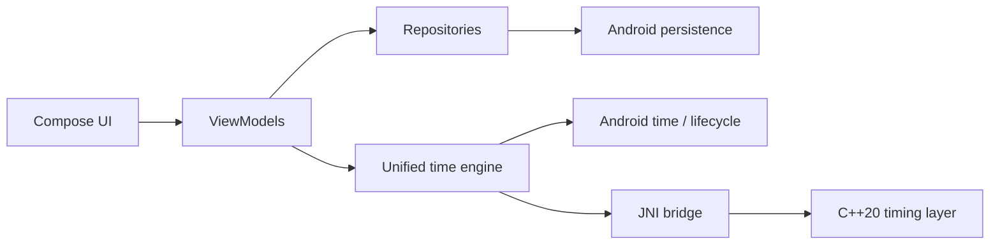
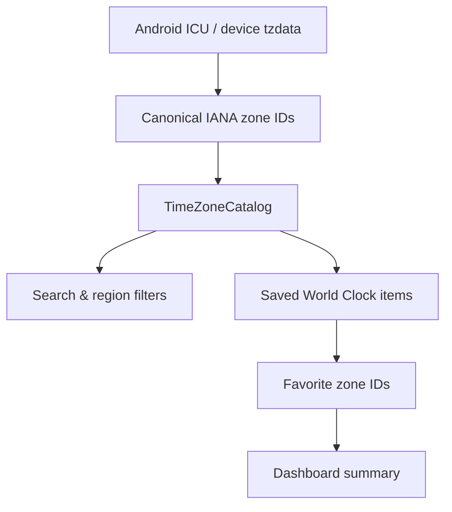
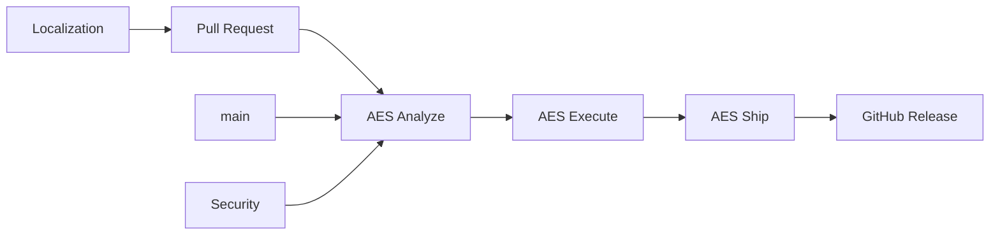

<!-- Copyright (c) 2026 Febrian Rahmad Cahya. All rights reserved. -->

# Chrona

[](https://github.com/FebriCahyaa/Chrona/actions/workflows/ci.yml)
[](https://github.com/FebriCahyaa/Chrona/actions/workflows/security.yml)
[](LICENSE)

**A calm, precise Android time workspace.**

Chrona combines local time, Alarm, Timer, Stopwatch, and World Clock features in a Jetpack Compose application with a unified time engine, persistent feature state, adaptive layouts, and a reproducible GitHub Actions delivery pipeline.

## Highlights

- 🕒 Unified wall-clock and monotonic timing abstractions.
- ⏰ Persistent alarms with Android scheduling/receiver integration.
- ⏱️ Timer and Stopwatch with durable state handling.
- 🌍 World Clock backed by the device's current ICU/IANA timezone data rather than a frozen city list.
- 🎨 Compose + Material 3 UI with responsive/adaptive layouts.
- 🔐 Dependency, CodeQL, Scorecard, licensing, and release-provenance checks.
- 🌐 Crowdin-based localization workflow.
- 🤖 Dedicated Telegram bots for CI, PR, Dependabot, and release events.

## Architecture



## World Clock data model



Chrona follows the timezone data shipped by the Android runtime. The IANA upstream reference for this repository documentation is release 2026d, published 2026-09-11. Chrona does not vendor a duplicate static copy. See https://www.iana.org/time-zones/releases/2026d.

## CI/CD

Chrona uses **AES — Analyze → Execute → Ship**.



The production build is intentionally separate from normal PR CI and is protected by the `release` GitHub Environment.

## Build toolchain

| Tool | Project pin |
| --- | --- |
| Gradle | 9.7.1 |
| Android Gradle Plugin | 9.4.0 |
| Kotlin | 2.4.10 |
| Gradle runtime JDK | 25 |
| Java/Kotlin compilation toolchain | 17 |
| Android API | 37 / Platform 37.1 |
| Build Tools | 37.0.0 |
| CMake | 3.31.5 |
| NDK | 28.2.13676358 |

## Repository layout

See [`docs/repository/REPOSITORY_STRUCTURE.md`](docs/repository/REPOSITORY_STRUCTURE.md).
Historical phase records are isolated under `docs/archive/` and are not used by active build, test, or release tooling.

## Local development

```bash
chmod +x ./gradlew
./scripts/audit/source-audit.sh
./gradlew testDebugUnitTest
./gradlew lintDebug
./gradlew assembleDebug
```

For environment setup guidance, see [`docs/build/BUILD_ENVIRONMENT.md`](docs/build/BUILD_ENVIRONMENT.md).

## Localization

English is the source language. Translations are managed with Crowdin and synchronized back to Android resource directories through GitHub Actions. See [`docs/localization/LOCALIZATION.md`](docs/localization/LOCALIZATION.md) and [`docs/localization/LANGUAGES.md`](docs/localization/LANGUAGES.md).

## Security and licensing

Chrona's original source/design/documentation remain proprietary. Third-party software stays under its own licenses and notices. See:

- [`LICENSE`](LICENSE)
- [`COPYRIGHT.md`](COPYRIGHT.md)
- [`docs/legal/DEPENDENCY_LICENSES.md`](docs/legal/DEPENDENCY_LICENSES.md)
- [`third_party/licenses/THIRD_PARTY_NOTICES.md`](third_party/licenses/THIRD_PARTY_NOTICES.md)
- [`SECURITY.md`](SECURITY.md)

GitHub Dependency Review provides dependency-diff visibility and can enforce vulnerability/license rules on pull requests.

## Telegram operations

Four independent Telegram bots are supported so CI, pull-request, Dependabot, and release notifications are not mixed together. Configuration is documented in [`docs/operations/TELEGRAM_BOTS.md`](docs/operations/TELEGRAM_BOTS.md).

## Symlinks

Do not use repository-required symlinks. Shared build/CI logic belongs in Gradle version catalogs, reusable Actions, composite Actions, or versioned scripts. See [`docs/repository/SYMLINK_POLICY.md`](docs/repository/SYMLINK_POLICY.md).

## License

© 2026 Febrian Rahmad Cahya. All rights reserved.
