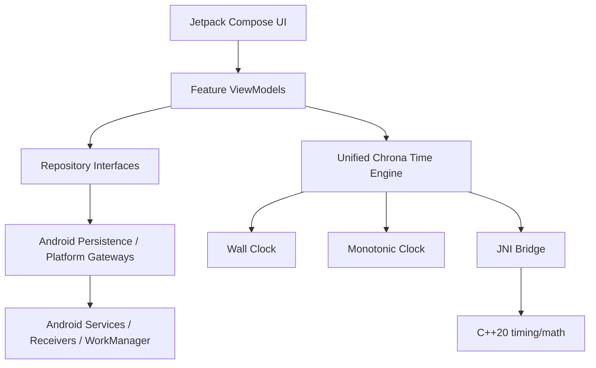

<!-- Copyright (c) 2026 Febrian Rahmad Cahya. All rights reserved. -->
# Chrona Architecture

## Layers

| Layer | Responsibility |
| --- | --- |
| `ui/` | Compose screens, reusable components, theme and screen state rendering |
| `ui/viewmodel/` | Feature state machines and user-intent orchestration |
| `data/` | Persistence and external data access |
| `model/` | Immutable feature models |
| `navigation/` | Route definitions and navigation policy |
| `time/` | Unified wall-clock/monotonic timing abstractions |
| `alarm/` | Exact alarm scheduling, receivers, services, notification/audio behavior |
| `timer/` | Timer persistence, scheduling, receivers, and foreground service |
| `core/` | Cross-cutting timing/math/configuration helpers |
| `data/timezone/` | Runtime timezone catalog backed by Android ICU/IANA IDs |

## State ownership

Long-lived feature state is owned by feature ViewModels and exposed as `StateFlow`. The application composition root collects the feature flows once and passes immutable state into destinations. This keeps Dashboard and detail screens synchronized without duplicating repositories or creating per-screen state copies.

## Navigation

Routes are centralized in `ChronaRoutes`. Query arguments are URL-encoded using JVM-safe code rather than Android framework APIs so route logic remains testable in local JVM tests.
