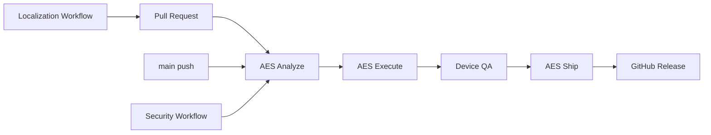

<!-- Copyright (c) 2026 Febrian Rahmad Cahya. All rights reserved. -->
# Chrona CI/CD

Chrona uses an **AES** convention for its delivery flow:

- **Analyze** — source/resource/license/security/toolchain checks.
- **Execute** — unit tests, lint, compilation, debug builds and device QA.
- **Ship** — signed artifacts, checksums, provenance attestations and GitHub Releases.

## Toolchain

- Gradle 9.7.1
- AGP 9.4.0
- Kotlin 2.4.20
- JDK 25 for Gradle runtime
- JDK 17 compilation toolchain
- Android API 37 / Platform 37.1
- Build Tools 37.0.0
- CMake 3.31.5
- NDK 28.2.13676358

Build pins are centralized in the version catalog and `.github/actions/setup-android/action.yml`.

## Workflows

| Workflow | Trigger | Purpose |
| --- | --- | --- |
| `ci.yml` | PR / push / manual | Repository audit, unit tests, lint, debug APK |
| `device-qa.yml` | PR / main / manual | Android 17 emulator instrumentation |
| `security.yml` | PR / main / weekly | Dependency review, CodeQL, Scorecard, license audit |
| `maintenance.yml` | weekly / manual | Source, resource, locale, dependency-graph and Android CLI maintenance |
| `localization.yml` | source-string change / weekly / manual | Crowdin source/translation synchronization and PR creation |
| `release.yml` | tag / manual | Release validation, signing, APK/AAB publication |
| `telegram-*.yml` | event-specific | Dedicated Telegram notifications |

## Release gate

Production publication requires the `release` GitHub Environment. Release workflows must not commit generated version/changelog changes back to `main`; source changes belong in normal reviewable commits.

## Telegram notification separation

The Telegram workflows intentionally use four independent credentials/chats: CI, ordinary pull requests, Dependabot, and releases. PR-triggered workflow results are excluded from the CI bot so the PR/Dependabot bot remains the single event notification for that change. Release publication is announced only by the release bot. See `docs/operations/TELEGRAM_BOTS.md`.

## Release signing boundary

The release workflow validates source/version identity and debug verification before restoring signing material. The signing keystore is created only in the runner's temporary directory from GitHub Environment Secrets; release assembly depends on `verifyReleaseSigning`, and cleanup runs even when the job fails.
