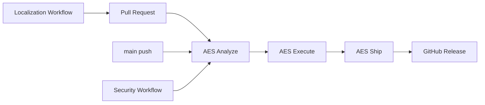
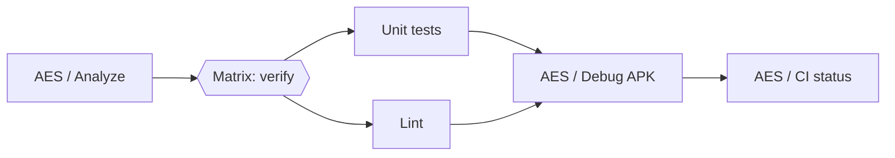
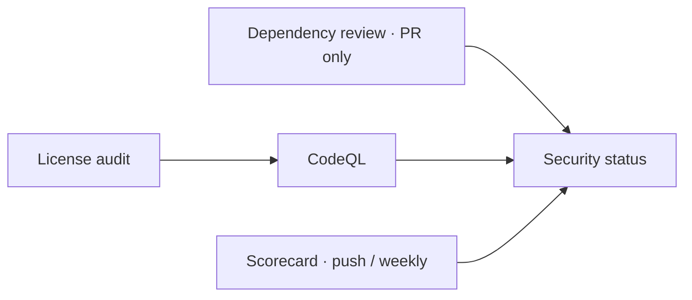
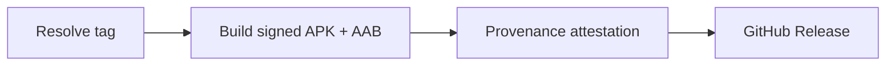

<!-- Copyright (c) 2026 Febrian Rahmad Cahya. All rights reserved. -->
# Chrona CI/CD

Chrona uses an **AES** convention for its delivery flow:

- **Analyze** — source/resource/license/security/toolchain checks.
- **Execute** — unit tests, lint, compilation and debug builds.
- **Ship** — signed artifacts, checksums, provenance attestations and GitHub Releases.

## Pipeline graphs

Every core workflow is a staged job graph (`needs`) so a run renders as a left-to-right pipeline in the Actions UI. Matrix legs are grouped into one node and each pipeline ends with an aggregate gate job.

**Chrona CI** (`ci.yml`)

**Chrona Security** (`security.yml`)

**Chrona Release** (`release.yml`)

Required status checks for `main` (branch protection) can be limited to `AES / CI status` and `Security status`, or list the individual `AES / Analyze`, `AES / Unit tests`, `AES / Lint` and `AES / Debug APK` jobs.

## Toolchain

- Gradle 9.7.1
- AGP 9.4.0
- Kotlin 2.4.10
- JDK 25 for Gradle runtime
- JDK 17 compilation toolchain
- Android API 37 / Platform 37.1
- Build Tools 37.0.0
- CMake 3.31.5
- NDK 28.2.13676358

Build pins are centralized in the version catalog and `.github/actions/setup-android/action.yml`.

## Workflows

| Workflow | Trigger | Purpose |
| --- | --- | --- |
| `ci.yml` | PR / push / manual | Repository audit → unit tests + lint (matrix) → debug APK → CI status gate |
| `security.yml` | PR / main / weekly | License audit → CodeQL, dependency review, Scorecard → security status gate |
| `maintenance.yml` | weekly / manual | Source, resource, locale, dependency-graph and Android CLI maintenance |
| `localization.yml` | source-string change / weekly / manual | Crowdin source/translation synchronization and PR creation |
| `release.yml` | tag / manual | Tag validation → signed build → provenance attestation → GitHub Release |
| `telegram-*.yml` | event-specific | Dedicated Telegram notifications |

## Release gate

Production builds require the `release` GitHub Environment (attached to the build job that consumes the signing secrets). Release workflows must not commit generated version/changelog changes back to `main`; source changes belong in normal reviewable commits.

## Telegram notification separation

The Telegram workflows intentionally use four independent credentials/chats: CI, ordinary pull requests, Dependabot, and releases. PR-triggered workflow results are excluded from the CI bot so the PR/Dependabot bot remains the single event notification for that change. Release publication is announced only by the release bot. See `docs/operations/TELEGRAM_BOTS.md`.

## Release signing boundary

The release workflow validates the tag and source/version identity before restoring signing material. The signing keystore is created only in the runner's temporary directory from GitHub Environment Secrets; release assembly depends on `verifyReleaseSigning`, and cleanup runs even when the job fails. Attestation (`id-token`, `attestations`) and publication (`contents: write`) run in separate jobs that only receive those permissions and never see the signing secrets.
